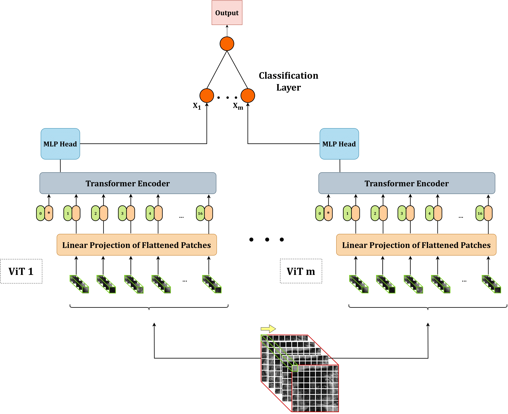

# 3D-Vision-Transformer Stacking Ensemble for Assessing Prostate Cancer Aggressiveness from T2w Images

Official code for [**3D-Vision-Transformer Stacking Ensemble for Assessing Prostate Cancer Aggressiveness from T2w Images**](https://www.mdpi.com/2306-5354/10/9/1015) based on [Pytorch reimplementation](https://github.com/jeonsworld/ViT-pytorch) by [jeonsworld](https://github.com/jeonsworld) of [Google's repository for the ViT model](https://github.com/google-research/vision_transformer) [An Image is Worth 16x16 Words: Transformers for Image Recognition at Scale](https://arxiv.org/abs/2010.11929) by Alexey Dosovitskiy. 



## Dataset
We utilized the [Prostate-X 2](https://www.cancerimagingarchive.net/collection/prostatex/) dataset for our experiments. To see pre-processing details, please refer to our paper.
According to our code, data should be stored according to the following structure:
```
├── dataset
│   └── ProstateX-YYYY
│       ├── original                             
│       ├── rotation
│       ├── horizontal_flip
│       ├── vertical_flip
```
The ProstateX-YYYY folder refers to single patient acquisition, while the four subfolders contain the original and augmented versions.

## Usage

### 1. Train baseline ViTs using CV or bootstrapping techniques
```
python train_baseline_cv.py
```
```
python train_baseline_bootstrap.py
```


### 2. Train ensemble ViTs using CV or bootstrapping techniques
```
python train_ensemble_cv.py
```
```
python train_ensemble_bootstrap.py
```
### 3. Test baseline and ensemble ViTs trained according to CV
```
python test.py
```

## Citations

```bibtex
@article{pachetti20233d,
  title={3D-Vision-Transformer Stacking Ensemble for Assessing Prostate Cancer Aggressiveness from T2w Images},
  author={Pachetti, Eva and Colantonio, Sara},
  journal={Bioengineering},
  volume={10},
  number={9},
  pages={1015},
  year={2023},
  publisher={MDPI}
}
```
